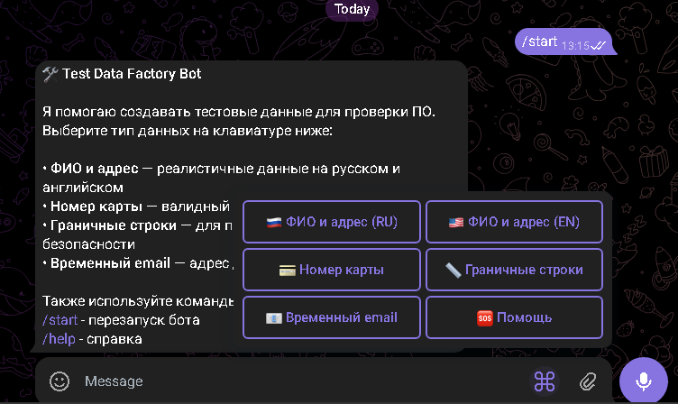
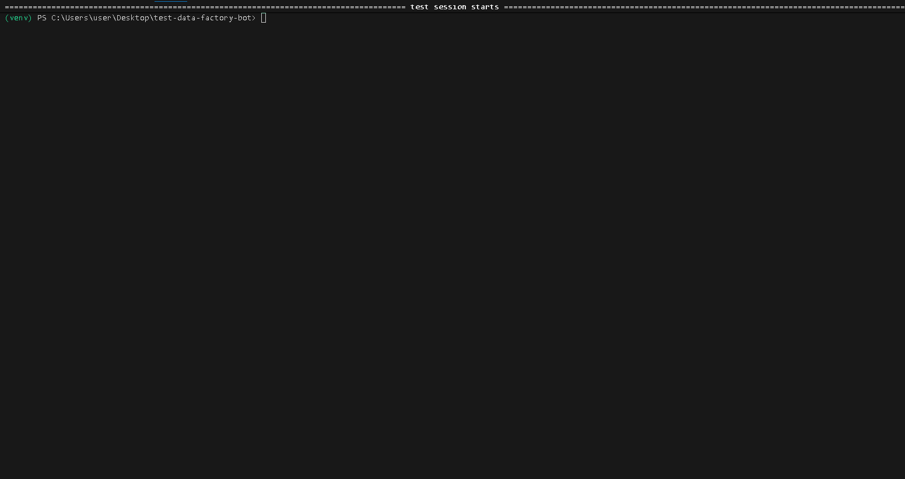

# 🧪 Test Data Factory Bot — Telegram бот для генерации тестовых данных

[](https://python.org)
[](https://core.telegram.org/bots/api)
[](https://pytest.org)
[](https://pytest-cov.readthedocs.io/)
[](https://github.com/feelinRain/test-data-factory-bot)
[](LICENSE)

Профессиональный Telegram бот для генерации реалистичных тестовых данных, разработанный специально для **QA инженеров** и **тестировщиков ПО**.

---

## 📌 Содержание
- [🧪 Test Data Factory Bot — Telegram бот для генерации тестовых данных](#-test-data-factory-bot--telegram-бот-для-генерации-тестовых-данных)
  - [📌 Содержание](#-содержание)
  - [✨ Возможности](#-возможности)
    - [📊 Генерация данных](#-генерация-данных)
    - [🎯 Фокус на тестировании](#-фокус-на-тестировании)
  - [📸 Скриншоты и Демо](#-скриншоты-и-демо)
    - [Основной интерфейс](#основной-интерфейс)
    - [Демонстрация работы](#демонстрация-работы)
  - [🚀 Быстрый старт](#-быстрый-старт)
    - [Предварительные требования](#предварительные-требования)
    - [Установка](#установка)
  - [🧪 Запуск тестов](#-запуск-тестов)
  - [🏗️ Архитектура проекта](#️-архитектура-проекта)
  - [🔧 Технические детали](#-технические-детали)
  - [💡 Применение для QA](#-применение-для-qa)
  - [🎯 Почему это важно для портфолио](#-почему-это-важно-для-портфолио)
  - [🤝 Вклад в проект](#-вклад-в-проект)
  - [📄 Лицензия](#-лицензия)
  - [⚠️ Важное предупреждение](#️-важное-предупреждение)
  - [🙏 Благодарности](#-благодарности)
  - [Контакты: @feelinRain](#контакты-feelinrain)

---

## ✨ Возможности

### 📊 Генерация данных
* **Реалистичные персональные данные (RU/EN):**
    * Телефоны в правильном формате для каждой локали.
    * Адреса в соответствии с региональными стандартами.
    * Имена и фамилии, соответствующие культурным особенностям.
* **Валидные номера кредитных карт:**
    * Генерация с использованием **алгоритма Луна**.
    * Типы карт: Visa, MasterCard, Mir.
    * Полные реквизиты: срок действия и CVV.
* **Граничные значения строк:**
    * Строки ровно по 255 символов (лимиты БД).
    * Специальные символы и Unicode.
    * Безопасные примеры SQL/XSS инъекций.
    * Пустые и сверхдлинные строки.
* **Временные email адреса:**
    * Случайно сгенерированные имена для одноразовых почтовых сервисов.

### 🎯 Фокус на тестировании
* **Ручное тестирование:** мгновенное получение данных для форм.
* **Boundary Values:** готовые наборы для анализа граничных значений.
* **Security Testing:** проверка уязвимостей через готовые паттерны.
* **L10n/I18n:** проверка локализации.

---

## 📸 Скриншоты и Демо

### Основной интерфейс

*Интерактивная клавиатура для быстрой генерации данных*

### Демонстрация работы
| Основной функционал | Запуск тестов |
| :--- | :--- |
|  |  |

---

## 🚀 Быстрый старт

### Предварительные требования
* Python 3.8+
* Токен бота от [@BotFather](https://t.me/BotFather)

### Установка

1.  **Клонируйте репозиторий**
    ```bash
    git clone [https://github.com/feelinRain/test-data-factory-bot.git](https://github.com/feelinRain/test-data-factory-bot.git)
    cd test-data-factory-bot
    ```

2.  **Создайте виртуальное окружение**
    ```bash
    python -m venv venv
    # Windows:
    venv\Scripts\activate
    # Linux/Mac:
    source venv/bin/activate
    ```

3.  **Установите зависимости**
    ```bash
    pip install -r requirements.txt
    ```

4.  **Настройте бота**
    Отредактируйте `config.py`, добавив ваш токен:
    ```python
    BOT_TOKEN = "ВАШ_ТОКЕН_БОТА"
    ```

5.  **Запустите бота**
    ```bash
    python bot.py
    ```

---

## 🧪 Запуск тестов
Проект включает комплексное тестовое покрытие (98%), демонстрирующее профессиональные практики QA.

```bash
# Запустить все тесты
pytest tests/ -v

# Запустить тесты с отчетом о покрытии
pytest tests/ --cov=. --cov-report=html

# Запустить конкретные категории тестов
pytest tests/test_generators.py::TestCreditCardGenerator -v
```

Что тестируется:

 - Валидация алгоритма Луна.

 - Корректность форматов для разных локалей.

 - Граничные случаи (пустые значения, некорректный ввод).

---

## 🏗️ Архитектура проекта

```Plaintext
test-data-factory-bot/
├── bot.py                    # Основное приложение бота
├── generators.py             # Логика генерации данных
├── tests/                    # Комплексный набор тестов
│   ├── test_generators.py    # Модульные тесты для генераторов
│   └── __init__.py
├── config.py                 # Конфигурация бота
├── requirements.txt          # Зависимости Python
├── .gitignore               # Правила игнорирования Git
├── README.md                # Этот файл
├── LICENSE                  # Лицензия MIT
└── screenshots/             # Скриншоты интерфейса бота
```

---

## 🔧 Технические детали
 - Библиотеки: python-telegram-bot (API), Faker (данные), pytest (тесты).

 - Алгоритмы: реализация проверки Луна для кредитных карт.

 - Локализация: поддержка динамического переключения Faker локалей.

---

## 💡 Применение для QA
Manual Testing: Быстрое заполнение "простыни" полей в формах регистрации.

Security Testing: Использование встроенных XSS/SQL payloads для проверки полей ввода.

Automation: Генератор можно импортировать как модуль в свои автотесты для создания динамических фикстур.

---

## 🎯 Почему это важно для портфолио
Этот проект — не просто "бот", а полноценная демонстрация навыков:

 1. Программирование на Python: чистый код, разделение логики и интерфейса.

 2. Инженерное мышление: решение конкретной боли тестировщика.

 3. Качество (Quality by Design): высокий процент покрытия тестами.

 4. Документирование: проект готов к использованию другими разработчиками.

---

## 📖 История разработки

### Этап 1: Прототипирование
- Анализ потребностей тестировщиков в тестовых данных
- Выбор технологического стека (Python, Telegram Bot API)
- Создание базовой архитектуры

### Этап 2: Разработка ядра
- Реализация генераторов данных с поддержкой локалей
- Интеграция алгоритма Луна для валидных номеров карт
- Создание интерактивного интерфейса бота

### Этап 3: Тестирование и оптимизация
- Написание 21+ модульных и интеграционных тестов
- Достижение 98% покрытия кода
- Оптимизация форматирования выходных данных
- Обработка edge cases и исключительных ситуаций

### Этап 4: Документирование и публикация
- Создание профессиональной документации
- Подготовка проекта для портфолио
- Публикация на GitHub с открытой лицензией

---

## 🤝 Вклад в проект
1. Сделайте Fork.

2. Создайте ветку feature/AmazingFeature.

3. Закоммитьте изменения.

4. Откройте Pull Request.

---

## 📄 Лицензия
Распространяется под лицензией MIT. Подробнее в файле [LICENSE](LICENSE).

---

## ⚠️ Важное предупреждение
**Все данные генерируются случайно:**

 - Номера карт проходят валидацию алгоритмом, но не являются платежными.

 - Персональные данные вымышлены.

 - Используйте только в тестовых средах!

---

## 🙏 Благодарности
- Команде python-telegram-bot за отличную библиотеку

- Faker за генерацию реалистичных тестовых данных

- pytest за фреймворк тестирования

## Контакты: @feelinRain

Project Link: https://github.com/feelinRain/test-data-factory-bot

Если проект был вам полезен, поставьте ⭐ на GitHub!
